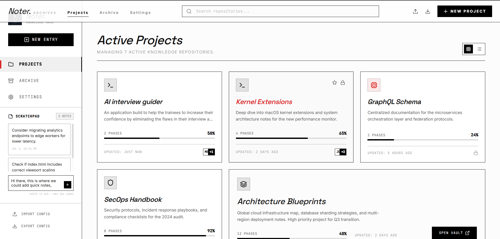
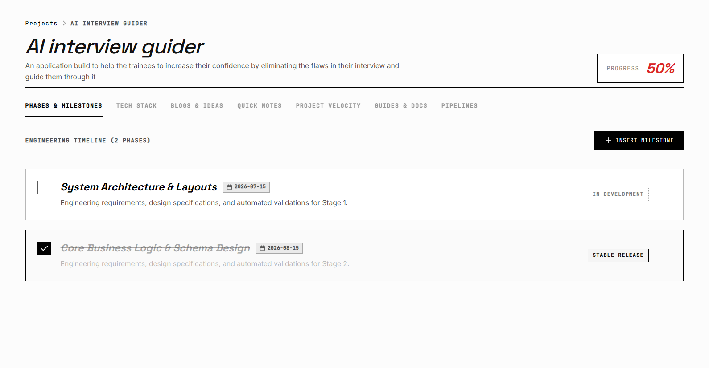
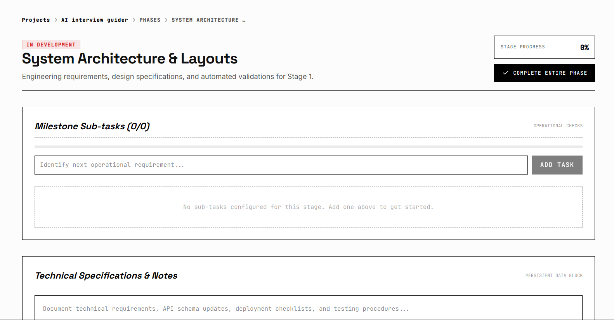
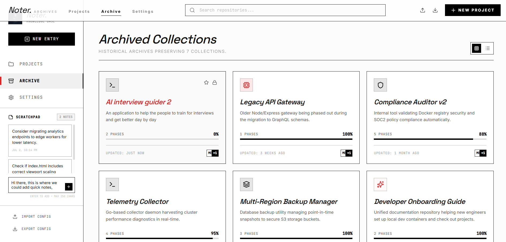
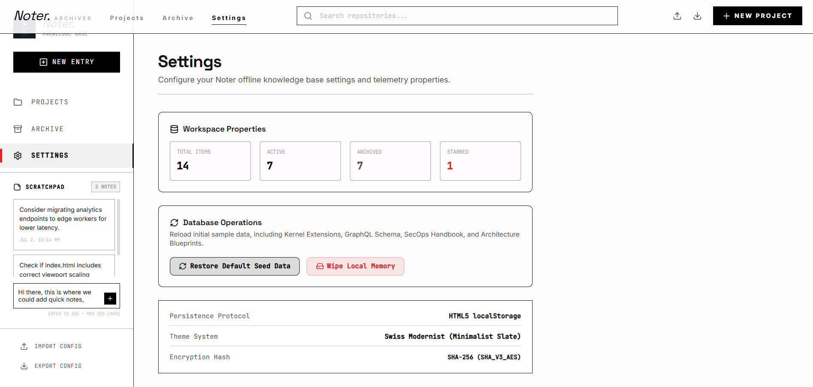

<div align="center">

# 📓 Noter

**A developer's project knowledge base — not just a to-do tracker.**

Track what you're building, why you built it that way, where you are, what's next, and what you learned — all in one place.

[](https://react.dev)
[](https://www.typescriptlang.org)
[](https://vitejs.dev)
[](https://tailwindcss.com)
[](https://ai.google.dev)
</div>
--- 

## Preview
### Home Dashboard

<p align="center">
  
</p>

### Features

<table>
  <tr>
    <td align="center">
      <br>
      <b>Project Workspace</b>
    </td>
    <td align="center">
      <br>
      <b>Project Timeline</b>
    </td>
  </tr>
  <tr>
    <td align="center">
      <br>
      <b>Archive</b>
    </td>
    <td align="center">
      <br>
      <b>Settings</b>
    </td>
  </tr>
</table>

---

## 🧠 Why Noter?

Most project trackers only answer "what's left to do." Noter goes further — it's built for developers who juggle multiple side projects and hackathon builds, and keeps a running record of:

- **What** you're building
- **Why** you chose a given tech stack, architecture, or approach
- **Where** you currently stand (auto-computed progress)
- **What's next** (phases and tasks)
- **What you learned** along the way (decision log)

No more forgetting why you picked Prisma over raw SQL three weeks ago.

## ✨ Features

- 📁 **Multi-Project Dashboard** — manage several projects from one place, each with its own progress bar
- 🧩 **Phases & Tasks** — break every project into phases, each with its own checklist
- 🛠️ **Tech Stack Log** — record what you used, *why* you used it, and what alternatives you considered
- 📜 **Decision Log** — a timeline of key decisions, their reasoning, and their current status
- 💡 **Ideas / Backlog** — capture future ideas without cluttering active work
- 📊 **Auto-Computed Progress** — completion percentage is always derived live, never stale
- 🤖 **AI-Assisted Insights** — powered by the Gemini API for smart suggestions across your project data

## 🖥️ Tech Stack

| Layer | Technology |
|---|---|
| Framework | React 19 + TypeScript |
| Build Tool | Vite 6 |
| Styling | Tailwind CSS 4 |
| Icons | Lucide React |
| Animation | Motion |
| Charts | Recharts |
| Server | Express (local dev) |

## 🚀 Getting Started

### Prerequisites

- Node.js (v18+ recommended)

### Installation

```bash
git clone https://github.com/Sadiq-Kolakar/Noter.git
cd Noter
npm install
```

### Run Locally

```bash
npm run dev
```

The app will be available at `http://localhost:3000`.

### Build for Production

```bash
npm run build
npm run preview
```

## 📂 Project Structure

```
Noter/
├── src/                # Application source (components, logic, views)
├── index.html          # Entry HTML
├── package.json         # Dependencies & scripts
├── tsconfig.json        # TypeScript config
├── vite.config.ts       # Vite build config
└── .env.example         # Environment variable template
```

## 🗺️ Roadmap

- [ ] Multi-device sync
- [ ] Export/import project data (JSON backup)
- [ ] Public project sharing (read-only links)
- [ ] Mobile-friendly layout

## 👤 Author

**Sadiq Kolakar**
[GitHub](https://github.com/Sadiq-Kolakar)

## 📄 License

This project is licensed under the [MIT License](LICENSE.md).
